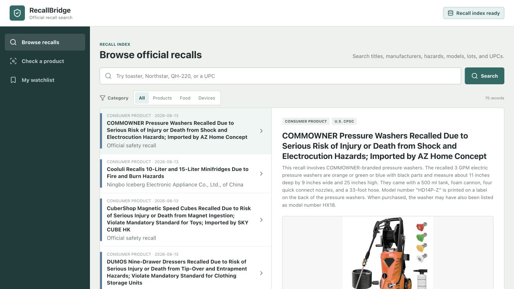
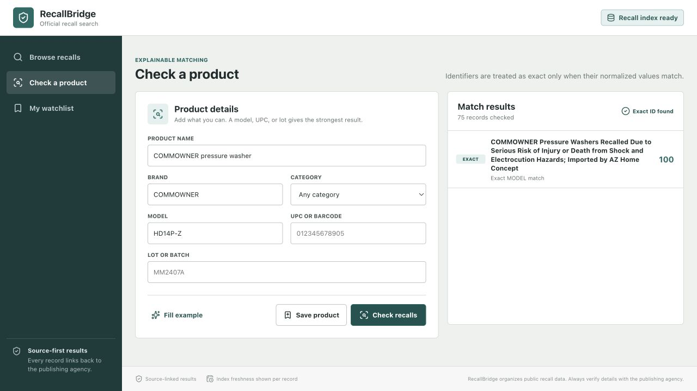
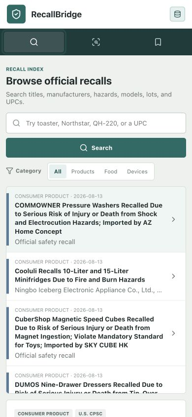

# RecallBridge

RecallBridge is a source-linked product recall search and watchlist application. It brings recent consumer product, food, and medical device recall records into one normalized interface, then explains why a saved product may match a recall.

> RecallBridge is an educational open-source project, not an official alerting service. Always confirm a result with the publishing agency before taking action.



## Why It Exists

Recall information is published across separate agency systems with different schemas. RecallBridge provides one practical workflow for:

- browsing recent official records;
- searching by product, manufacturer, model, UPC, or hazard;
- checking a product with explainable match confidence;
- keeping a browser-local watchlist without creating an account; and
- opening the original agency record for verification.

## Data Sources

| Source | Coverage used in this project | Connector |
|---|---|---|
| [U.S. Consumer Product Safety Commission](https://www.cpsc.gov/Recalls) | Consumer products | SaferProducts.gov recall API |
| [openFDA Food Enforcement](https://open.fda.gov/apis/food/enforcement/) | Food enforcement reports | openFDA API |
| [openFDA Device Recall](https://open.fda.gov/apis/device/recall/) | Medical device recalls | openFDA API |

The repository includes six clearly labeled fictional records so the app works before its first sync. A successful official-data sync removes those demo records. The generated SQLite database is intentionally excluded from Git.

## Product Tour

### Browse official recalls

Search, filter, inspect hazards and remedies, and follow every result back to its publishing source.


### Check a product

Enter a product name or identifier. RecallBridge ranks possible matches and shows the evidence behind each confidence level.



### Use it on a phone

The operational layout collapses into a compact mobile workflow without hiding source or safety information.



## How Matching Works

RecallBridge uses deterministic, inspectable rules rather than a black-box classifier:

- **Exact**: a model, UPC, or lot identifier matches.
- **Strong**: multiple product, brand, manufacturer, or category signals agree.
- **Possible**: a smaller number of descriptive signals overlap.

Every result contains human-readable match reasons. A match is a lead for verification, not proof that a particular item is recalled.

## Architecture

```text
Official APIs
    |
    v
Source connectors -> normalized Pydantic records -> SQLite index
                                                  |
React client <- FastAPI search and match endpoints+
    |
Browser-local watchlist
```

## Project Structure

```text
recallbridge/
├── backend/
│   ├── data/                 # fictional seed records; generated DB is ignored
│   ├── recallbridge/         # API, storage, matching, and source connectors
│   └── tests/
├── e2e/                      # Playwright user-flow tests
├── scripts/sync_recalls.py   # official source synchronization
├── src/                      # React and TypeScript client
├── CONTRIBUTING.md
├── SECURITY.md
└── README.md
```

## Local Setup

Requirements: Python 3.12+, Node.js 22+, and npm.

```bash
git clone https://github.com/gokul-debugger/recallbridge.git
cd recallbridge

python3.12 -m venv .venv
source .venv/bin/activate
python -m pip install --upgrade pip
pip install -r backend/requirements-dev.txt

npm ci
```

Synchronize recent official records:

```bash
python scripts/sync_recalls.py --days 365 --limit 100
```

Start the API:

```bash
uvicorn recallbridge.app:app --app-dir backend --reload --port 8000
```

In a second terminal, start the client:

```bash
npm run dev
```

Open [http://127.0.0.1:5173](http://127.0.0.1:5173). API documentation is available at [http://127.0.0.1:8000/docs](http://127.0.0.1:8000/docs).

## Quality Checks

```bash
npm run lint
npm run test
npm run build

pytest -q
ruff check backend scripts

npx playwright install chromium
npm run test:e2e
```

Current automated coverage includes connector normalization, search and matching APIs, exact and possible match behavior, browser-local watchlist persistence, recall browsing, and responsive product-save flows.

## Privacy And Safety

- Watchlist products stay in the current browser's local storage.
- No user account, analytics tracker, or product identifier is sent to a third party by the client.
- The backend only requests public recall records from the listed agencies during an explicit sync.
- openFDA notes that enforcement reports should not be treated as an official alerting or recall lifecycle service. RecallBridge preserves source links and presents the data as a searchable index.

Please report security concerns using the process in [SECURITY.md](SECURITY.md).

## Limitations

- Initial coverage is limited to the three listed U.S. data feeds.
- Source schemas and publication delays differ.
- Text matching can miss aliases or produce possible matches that require manual review.
- The watchlist does not perform background notifications. Recheck saved products after syncing data.
- RecallBridge does not replace agency guidance, manufacturer instructions, or professional advice.

## Roadmap

- Add source adapters for more countries and agencies.
- Add scheduled sync metadata and stale-source warnings.
- Support watchlist import and export without an account.
- Improve identifier normalization and add source-specific contract tests.
- Add optional, privacy-preserving notifications as a separate service.

Contributions are welcome. Start with [CONTRIBUTING.md](CONTRIBUTING.md) and an issue describing the user problem you want to solve.

## License

[MIT](LICENSE) © 2026 Gokul Krishna
